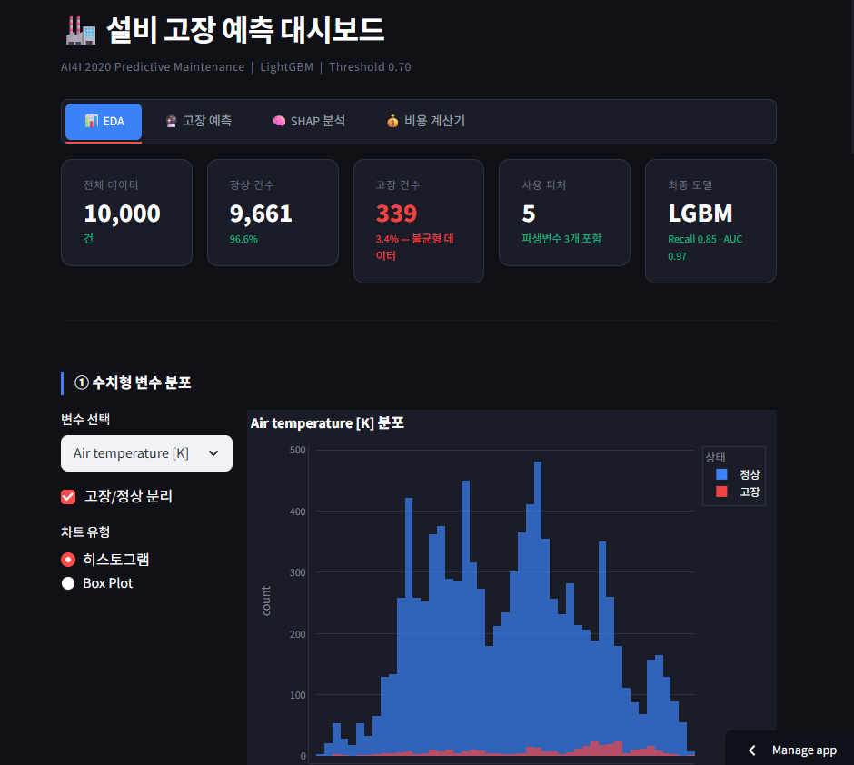
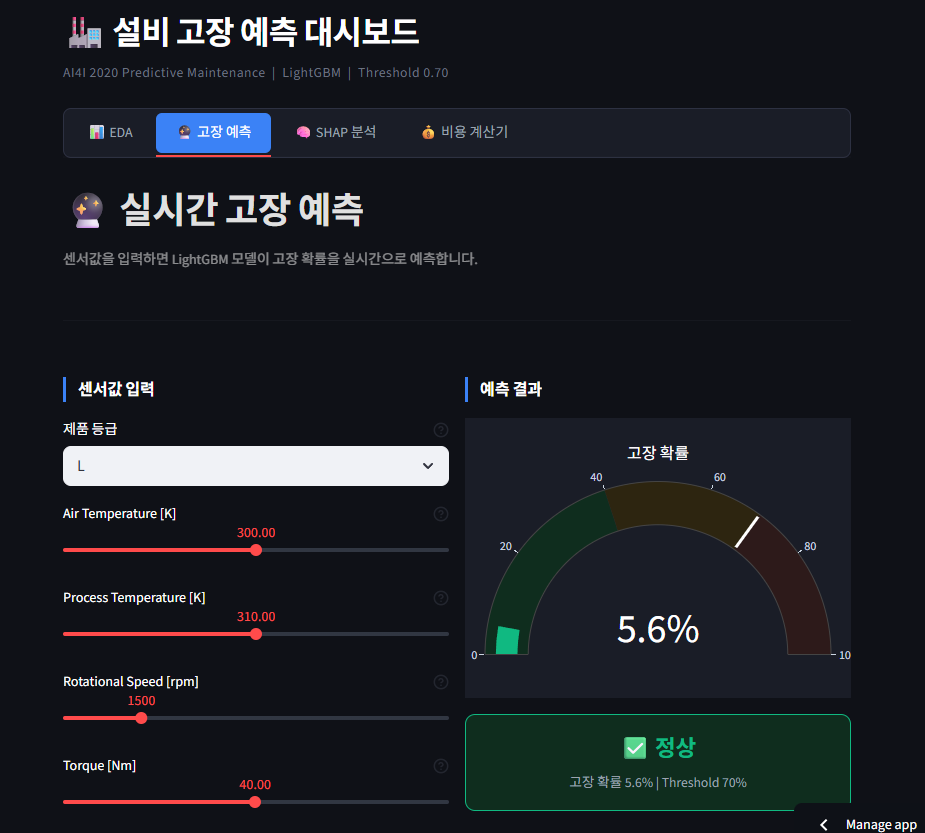
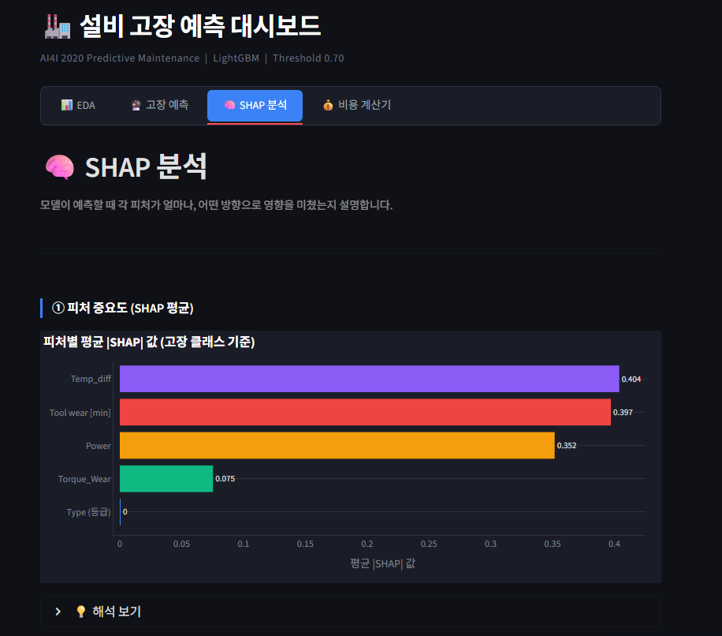
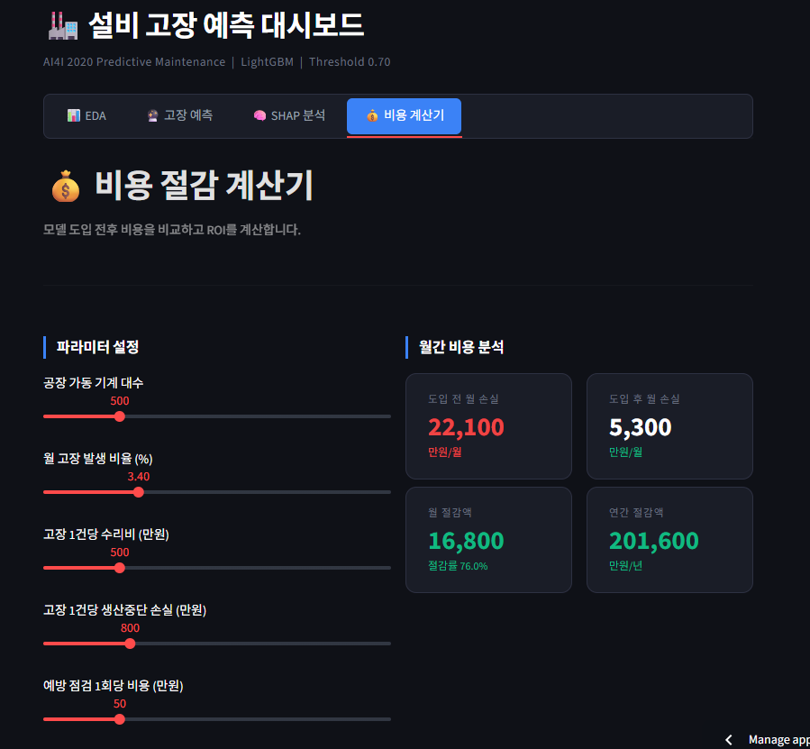
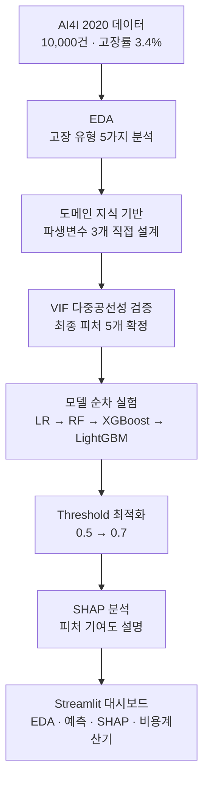

<div align="center">

# 🏭 설비 고장 예측 대시보드
### AI4I 2020 기반 Predictive Maintenance 시스템

**"고장이 난 다음 고치는 것이 아니라, 고장 나기 전에 막는 시스템을 만들었습니다."**

[](https://python.org)
[](https://lightgbm.readthedocs.io)
[](https://shap.readthedocs.io)
[](https://streamlit.io)
[](https://plotly.com)

### 🌐 [라이브 데모 바로가기 →](https://ai4i-predictive-maintenance-ddhrq3ekz7dvtdfwrlz4mc.streamlit.app/)

</div>

---

## 📸 서비스 화면

<table>
  <tr>
    <td align="center" width="50%">
      
      <br/><sub><b>EDA — 10,000건 데이터 탐색 · LightGBM · Recall 0.85 · AUC 0.97</b></sub>
    </td>
    <td align="center" width="50%">
      
      <br/><sub><b>실시간 고장 예측 — 센서값 입력 → 고장 확률 즉시 계산</b></sub>
    </td>
  </tr>
  <tr>
    <td align="center" width="50%">
      
      <br/><sub><b>SHAP 분석 — 직접 설계한 파생변수 Temp_diff가 기여도 1위</b></sub>
    </td>
    <td align="center" width="50%">
      
      <br/><sub><b>비용 계산기 — 월 16,800만원 절감 · 연간 201,600만원 절감</b></sub>
    </td>
  </tr>
</table>

> 📁 `docs/screenshots/` 폴더에 `eda.png` · `prediction.png` · `shap.png` · `cost.png` 순서로 이미지를 추가하면 자동 표시됩니다.

---

## 🎯 핵심 차별화 포인트

| | 일반 접근 | **이 프로젝트** |
|---|---|---|
| **피처 설계** | 원본 데이터 컬럼 그대로 사용 | **도메인 지식 기반 파생변수 3개 직접 설계** |
| **설계 검증** | 모델 성능으로만 확인 | 파생변수와 실제 고장 조건 일치율 **100% 검증** |
| **모델 선택** | 단일 모델 사용 | LR → RF → XGBoost → **LightGBM 순차 실험** |
| **임계값 처리** | 기본값(0.5) 사용 | **Threshold 0.7 최적화**로 Recall 향상 |
| **결과 제공** | 수치 출력으로 완료 | **4탭 인터랙티브 대시보드** + **비용 ROI 계산기** |

---

## 💰 비즈니스 임팩트

> 단순 모델 성능이 아닌, **실제 현장에서 얼마나 의미 있는가**를 수치로 증명했습니다.

| 지표 | 값 |
|------|-----|
| 고장 탐지율 (Recall) | **0.85** |
| ROC-AUC | **0.97** |
| 월 비용 절감 (500대 기준) | **16,800만원** |
| 연간 비용 절감 | **201,600만원** |
| 절감률 | **76.0%** |

---

## 🏗️ 시스템 아키텍처



---

## 🧠 핵심 구현

### 도메인 지식 기반 파생변수 설계

단순히 원본 컬럼을 모델에 넣은 것이 아니라, 고장 유형별 물리적 원인을 분석하여 **파생변수를 직접 설계**했습니다.

| 파생변수 | 수식 | 탐지 목표 | 고장 조건 일치율 |
|---------|------|----------|:---------------:|
| `Temp_diff` | Process temp − Air temp | HDF (열 방출 실패) | **100%** |
| `Power` | Torque × rpm × (2π/60) | PWF (전력 과부하) | **100%** |
| `Torque_Wear` | Torque × Tool wear | OSF (과부하 마모) | **100%** |

> SHAP 분석 결과 직접 설계한 파생변수 3개가 **피처 중요도 상위 1~3위** 차지

### 모델 비교 실험

| 모델 | Recall | ROC-AUC | F1-score |
|------|:------:|:-------:|:--------:|
| Logistic Regression | 0.88 | 0.87 | 0.16 |
| Random Forest | 0.75 | 0.94 | 0.68 |
| XGBoost | 0.79 | 0.96 | 0.71 |
| **LightGBM (최종)** | **0.85** | **0.97** | **0.69** |

### 실무 조치 기준 도출

SHAP 분석 결과를 바탕으로 고장 유형별 **구체적인 현장 대응 기준**을 도출했습니다.

```
Tool wear ≥ 200분      → 교체 필요 (TWF)
Temp_diff ≤ 9K + rpm ≤ 1,380  → HDF 위험
Power ≥ 7,000W         → PWF 점검 필요
```

---

## 🔥 Trouble Shooting

### 불균형 데이터 — 고장 3.4% vs 정상 96.6%

**문제**: 고장 데이터가 전체의 3.4%에 불과해 모델이 "전부 정상"으로만 예측하는 경향

**해결**:
- `class_weight='balanced'` 적용으로 소수 클래스 가중치 자동 보정
- Threshold를 기본값 0.5 → **0.7로 최적화**하여 Recall 향상
- 5-Fold 교차검증으로 일반화 성능 검증

**학습**: 불균형 데이터에서 Accuracy만 보면 안 됨 — 고장 탐지 문제에서는 **Recall이 핵심 지표**

---

### 파생변수 설계 — 모델이 아닌 도메인으로 접근

**문제**: 원본 피처만으로는 고장 유형별 물리적 원인을 모델이 학습하기 어려움

**접근**: 제조 설비 도메인 지식을 역으로 분석
- HDF(열 방출 실패)는 공기 온도와 공정 온도의 차이가 핵심 → `Temp_diff` 설계
- PWF(전력 과부하)는 토크와 회전속도의 조합 → `Power` 설계
- OSF(과부하 마모)는 토크와 마모의 상호작용 → `Torque_Wear` 설계

**결과**: 파생변수 3개가 실제 고장 조건과 **100% 일치** 확인, SHAP 중요도 1~3위 차지

---

## 📊 대시보드 구성

| 탭 | 주요 기능 |
|----|----------|
| 📊 **EDA** | 수치형 변수 분포 · 고장 유형 분석 · 상관관계 히트맵 |
| 🔮 **고장 예측** | 센서값 슬라이더 입력 → 실시간 고장 확률 게이지 |
| 🧠 **SHAP 분석** | 피처 중요도 · Summary Plot · Waterfall Plot |
| 💰 **비용 계산기** | 기계 대수·고장률 파라미터 조정 → ROI 실시간 계산 |

---

## 📁 프로젝트 구조

```
AI4I-Predictive-Maintenance/
├── 01_EDA.ipynb           # 탐색적 데이터 분석
├── 02_modeling.ipynb      # 모델 비교 실험 + Threshold 최적화
├── 03_business.ipynb      # 비즈니스 인사이트 + 비용 절감 계산
├── app.py                 # Streamlit 대시보드
├── requirements.txt
└── data/
    └── ai4i2020.csv
```

---

## 🚀 실행 방법

> 💡 바로 써보고 싶다면 위의 [라이브 데모](https://ai4i-predictive-maintenance-ddhrq3ekz7dvtdfwrlz4mc.streamlit.app/)를 이용하세요.

```bash
git clone https://github.com/rkdwltn1211/AI4I-Predictive-Maintenance.git
cd AI4I-Predictive-Maintenance

pip install -r requirements.txt

streamlit run app.py
# → http://localhost:8501
```

---

<div align="center">

**📬 문의는 GitHub Issues 또는 [rkdwl3264@naver.com](mailto:rkdwl3264@naver.com)으로 남겨주세요**

[](https://github.com/rkdwltn1211)

</div>
